# 扩展机制

喧喧提供了最大程度的定制和功能扩展机制（需要 1.3.0 以上版本），使得开发者非常方便的为喧喧开发新的功能，并且不受官方版本升级的影响，同时也可以利用此机制来实现自己的定制版本。由于扩展是可插拔的，所以用户使用起来非常灵活。喧喧的扩展机制依赖 Node.js 环境，目前仅支持基于 Electron 平台实现的客户端上的扩展，浏览器端不支持扩展机制。

## 扩展定义

### 扩展类型

喧喧客户端扩展目前有三种类型来满足不同的需要：

* 应用扩展（`app`）：将用户自行开发的界面已应用的形式集成到客户端中，用户点击对应的应用图标就可以直接在喧喧中打开应用界面进行使用；
* 插件扩展（`plugin`）：扩展提供后台脚本供客户端调用来扩展现有的功能；
* 主题扩展（`theme`）：提供额外的界面风格供用户切换使用。

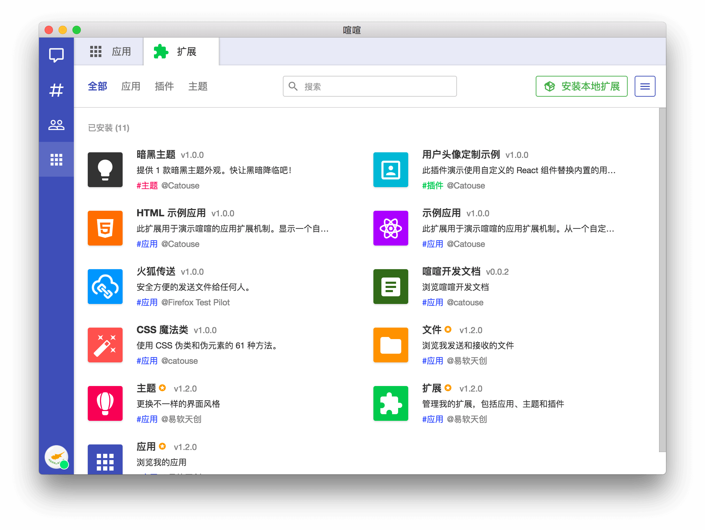

### 扩展包目录结构

喧喧的扩展为一个 `zip` 压缩包文件，客户端读取压缩包内的 `package.json` 描述文件来使用扩展。当把一个打包后的扩展解压后通常会包含如下的文件结构：

```txt
extension-dir/
 ├─ package.json    # 描述文件（必须）
 ├─ icon.png        # 扩展图标文件 (当使用图片作为图标时必须)
 ├─ README.md       # 说明文件 （不是必须，但推荐）
 ├─ index.js        # 扩展主入口文件（当扩展类型为插件时必须提供）
 ├─ theme.css       # 扩展主题样式表（当扩展类型为主题时必须提供）
 └─ ...             # 其他在扩展中被引用的文件和目录
```

强烈推荐在扩展包目录内提供一个 `README.md` 文件，此文件内容会在用户查看扩展详情时显示。

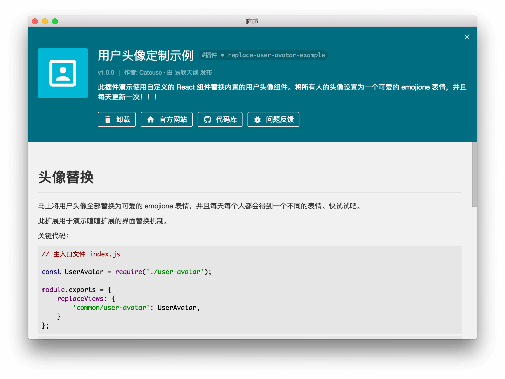

### 扩展描述文件 package.json

扩展描述文件是一个扩展必须提供的文件，用来描述一个扩展的名称、类型及其他关键信息。喧喧的扩展描述文件文件名为 `package.json`，兼容 [npm 包管理器中的 package.json 文件格式]((https://docs.npmjs.com/files/package.json))。一个最简单的应用扩展仅需要在扩展包中包含描述文件即可实现。以下为扩展描述文件中支持的配置项目：

```js
{
    // 扩展的名称，扩展名称只能包含字母、数字、短横线及下划线，且第一个字符必须为字母
    // 扩展的名称必须唯一，相同名称的扩展会提示覆盖或升级，为避免与其他扩展发生冲突，也可以使用 guid 做为扩展名称
    "name": "simple-extension",

    // 扩展在界面上显示的名称
    "displayName": "简单扩展",

    // 扩展的介绍文本
    "description": "这是一个简单扩展的例子。",

    // 扩展的版本
    "version": "1.0.0",

    // 扩展开发的作者
    "author": "Catouse",

    // 扩展的发布者
    "publisher": "易软天创",

    // 扩展许可协议类型
    "license": "MIT",

    // 扩展主页
    "homepage": "http://xuan.im/extensions",

    // 扩展配置对象
    "xext": {
        // 扩展类型，目前支持的类型包括：
        //   * app    -  应用扩展
        //   * plugin -  插件扩展
        //   * theme  -  主题扩展
        "type": "app",

        // 扩展图标，可以使用如下值
        //   * 使用 Material Design Icons (https://materialdesignicons.com/)，使用 mdi- 前缀，例如 mdi-star
        //   * 使用 http:// 或 https:// 协议开头图片地址，例如 http://zui.sexy/img/icon.png
        //   * 使用相对扩展包目录的相对地址，例如 img/icon.png
        // 需要注意：
        //   * 当扩展类型为 app 时，如果不指定则会使用应用图标（appIcon）
        //   * 如果使用图片作为扩展图标，确保作为图标的图片长宽比例为1:1（正方形图片），并且大小不小于 512x512
        "icon": "mdi-star",

        // 扩展主要颜色，可能被用到自动生成的图标上或作为部分界面背景
        "accentColor": "#aa00ff",

        // 针对扩展类型 app - 应用界面类型
        // 可选值包括：
        //   * insideView：提供 React 组件作为界面视图
        //   * webView：完整的网页视图
        "appType": "insideView",

        // 当 appType 为 webView 时加载的页面地址，可以包含以下格式的地址：
        //   * 使用 http:// 或 https:// 协议开头的网站页面地址，例如 http://zui.sexy/m
        //   * 使用相对扩展包目录的相对地址，通常指向一个 html 文件，例如 lib/page/index.html
        "webViewUrl": "http://zui.sexy/m",

        // 当 appType 为 webView 时，指定一个脚本在 webview 页面中其他脚本执行之前先加载，此脚本必须为扩展包内的 JavaScript 文件。
        "webViewPreloadScript": "lib/preload.js",

        // 针对扩展类型 app - 应用图标，可以使用如下值
        //   * 使用 Material Design Icons (https://materialdesignicons.com/)，使用 mdi- 前缀，例如 mdi-star
        //   * 使用 http:// 或 https:// 协议开头图片地址，例如 http://zui.sexy/img/icon.png
        //   * 使用相对扩展包目录的相对地址，例如 img/icon.png
        // 需要注意：
        //   * 如果不指定则会使用扩展图标（icon）作为应用图标
        //   * 如果使用图片作为应用图标，确保作为图标的图片长宽比例为1:1（正方形），并且大小不小于 512x512
        "appIcon": "mdi-star",

        // 针对扩展类型 app - 应用配色，可能被用到图标上，如果不指定会使用扩展的 accentColor
        "appAccentColor": "#aa00ff",

        // 针对扩展类型 app - 界面背景色，可以设置为透明（transparent），默认为白色 #fff
        "appBackColor": "#fff",

        // 针对扩展类型 plugin 或 app - 模块主要入口脚本文件位置，可以包含以下格式的地址：
        //   * 使用相对扩展包目录的相对地址，例如 lib/index.js
        // 当扩展类型为 plugin 时会自动从扩展包目录下寻找 index.js 文件作为模块主入口文件，如果符合此种情况则可以忽略此字段
        "main": "lib/index.js",

        // 是否允许热加载扩展，默认值为 false，如果设置为 true，则安装扩展后无需重启就能使用，但 onUserLogin（用户已经登录后，如果是重新登录仍然会生效） 和 replaceViews 将不会生效（仍然需要在下次重启时生效）
        "hot": false,

        // 针对扩展类型 theme - 主题列表
        // 通过一个对象数组，声明多个主题配置
        "themes": [
            {
                // 主题内部名称
                "name": "dark",

                // 主题的描述文本，可能会在界面上显示
                "description": "这是一个暗黑主题",

                // 主题显示名称
                "displayName": "暗色",

                // 主题 CSS 文件位置，可以是相对包的路径或者一个可访问的网址
                "style": "lib/themes/dark.css",

                // 主题的主要颜色
                "color": "#ff00f1",

                // 主题载入方式，可取值包括：
                //   * append   在默认样式的基础上附加样式
                //   * override 替代默认样式
                "inject": "override",

                // 主题的预览图片地址
                "preview": "lib/themes/preview-dark.png"
            }，
            // ... 其他主题配置对象
        ],

        // 扩展内配置
        "configurations": [
            {
                // 配置项名称
                "name": "cfg1",

                // 配置项显示名称
                "displayName": "配置项一",

                // 配置项描述
                "description": "配置项一的说明",

                // 配置项默认值
                "defaultValue": "默认值",

                // 配置项值类型，可选值包括，string, number, boolean, array, enum
                "valueType": "string",

                // 当使用枚举类型时的候选值列表
                "enumOptions": ["4324", "43243", {"name": "option1", "value": "value1"}],

                // 用于验证配置值是否合法的正则表达式
                "matchReg": "[a-zA-Z0-9]+",
            },
            // ... 其他配置项
        ]
    },

    // 扩展要求的运行环境
    "engines": {

        // 扩展对喧喧版本的支持
        "xuanxuan": "^${version}",

        // 扩展所支持的平台
        "platform": "electron,nwjs",

        // 扩展所依赖的其他扩展
        "extensions": [],
    },

    // 扩展关键字，可以用于搜索
    "keywords": ["xuanxuan", "im", "extension", "sample"],

    // Bugs 反馈页面
    "bugs": {
      "url": "https://github.com/easysoft/xuanxuan/issues"
    }，

    // 代码库地址
    "repository": {
        "url": "https://github.com/easysoft/xuanxuan/",
        "type": "git"
    },

    // ...兼容其他 npm package.json 属性
}
```

## 扩展接口

### 主入口模块接口

当扩展类型为应用（`app`）或插件（`plugin`）时，还可以通过描述文件（`package.json`）中的 `main` 字段定义一个主入口脚本文件。

!> 当扩展类型为插件（`plugin`）时，主入口脚本文件为必须的，如果没有在描述文件中通过 `main` 字段指定则会自动在扩展目录内查找 `index.js` 文件作为主入口文件。

主入口模块文件为一个 JavaScript 文件，遵从 CommonJS 模块规范，最终作为 Node.js 的模块加载到客户端应用中运行。扩展机制要求该模块导出为一个对象，该对象包含如下可以被客户端使用的字段：

#### `onAttach(ext)`

扩展生命周期函数：当扩展被加载后调用，此时可以对扩展进行初始化。函数参数定义如下：
* `ext`： 为当前被载入的扩展对象。

#### `onReady(ext)`

扩展生命周期函数：当界面加载完毕时调用，此时扩展可以处理与界面相关操作。函数参数定义如下：
* `ext` 为当前被载入的扩展对象。

#### `onDetach(ext)`

扩展生命周期函数：当扩展被卸载时调用，此时应该将扩展使用的资源进行释放，例如销毁定时器等。函数参数定义如下：
* `ext`：为当前被载入的扩展对象。


#### `onUserLogin(user, error)`

扩展生命周期函数：当用户登录完成时调用。函数参数定义如下：
* `user` 为登录的用户对象；
* `error` 当登录失败时返回的错误信息，如果登录成功，则此参数为 `null`。

#### `onUserLoginout(user)`

扩展生命周期函数：当当前登录的退出登录时调用。函数参数定义如下：
* `user` 为退出登录的用户对象。

#### `onUserStatusChange(status, oldStatus, user)`

扩展生命周期函数：当用户状态发生变化时调用。函数参数定义如下：
* `status` 为用户新的状态代码；
* `oldStatus` 为用户之前的状态代码；
* `user` 为当前状态发生变化的用户对象。

用户状态代码含义：
* `unverified` - `0`: 未登录；
* `disconnect` - `1`: 登录过，但掉线了；
* `logined` - `2`: 登录成功；
* `online` - `3`: 在线；
* `busy` - `4`: 忙碌；
* `away` - `5`: 离开。

#### `onSendChatMessages(messages, chat, user)`

扩展生命周期函数：当用户发送聊天消息时调用。函数参数定义如下：* `messages` 为用户要发送出去的消息对象数组
* `chat` 为用户发送消息的会话对象
* `user` 为当前发送消息的用户的对象

#### `onReceiveChatMessages(messages, user)`

扩展生命周期函数：当用户接收到聊天消息时调用。函数参数定义如下：
* `messages` 为用户接收到的消息对象数组
* `user` 为当前接收消息的用户的对象

#### `onRenderChatMessageContent(content)`

扩展生命周期函数：当在界面上需要转化 markdown 格式的消息文本为 html 时会调用此回调方法。函数参数定义如下：
* `messages` 为用户接收到的消息对象数组
* `user` 为当前接收消息的用户的对象

#### `MainView`

当扩展类型为应用（`app`）且 `appType` 为 `'insideView'` 时作为内嵌应用的 React 实现的界面主组件。`MainView` 应该返回一个 React 组件类或组件函数。

#### `replaceViews`

用于配置替换系统内置界面组件。`replaceViews` 为一个对象，对象的键名为要替换的组件路径，键值为要用来替换的 React 组件类或组件函数。


#### `commands`

扩展支持的命令。`commands` 为一个对象，对象的键名为响应的命令名称，键值为命令回调函数或者命令定义对象。


#### `contextMenuCreators`

为消息增加操作菜单。`contextMenuCreators` 为一个菜单生成对象数组，对象数组为每个菜单生成对象。菜单生成对象包括 `match` 属性用于定义匹配的菜单类型，`creator` 属性用于生成菜单项目的函数。


#### `urlInspectors`

网址解释器，可以将消息中的网址渲染成卡片形式。`urlInspectors` 为一个对象数组，每个对象包含有 `test` 属性为正则表达式用于匹配要解释的 url 地址，`inspector` 为回调函数（`function(url: string)`）用于生成 URL 对应的卡片参数。

#### 主入口模块示例

下面为一个简单等插件扩展主入口模块示例：

```js
// 从全局扩展对象中引入模块
const {
  app,
  components,
  utils
} = global.Xext;

// 用于存储计时器标志
let timerTask = null;

module.exports = {
    onAttach: (ext) => {
        // 扩展加载完毕了, 此时设置一个计时器，在加载完成 10 秒中之后在界面上显示一个消息
        timerTask = setTimeout(() => {
            alert('扩展加载完成已经 10 秒钟了，刚刚加载等扩展名称是：' + ext.displayName);
        });
    },

    onDetach: (ext) => {
        // 扩展将被卸载，此时应该清理计时器
        clearTimeout(timerTask);
        timerTask = null;
    },

    onUserLogin: (user, error) => {
        // 当用户登录时在此处可以进行相关操作，下面以显示当前登录等结果和用户名为例
        if (user && !error) { // 表示登录成功
            components.Modal.alert('用户登录成功了，用户名称是：' + user.displayName);
        } else {
            components.Modal.alert('用户登录失败了。');
        }
    },
}
```

### 全局扩展对象

在主入口模块内，可以通过全局对象 `global.Xext` 来访问喧喧应用为扩展提供的接口对象，该对象包含了喧喧所有内置的关键模块，主要包括如下内容：

| 模块名称 | 说明 |
| -------- | ---- |
| `lang` | 界面语言文本管理模块，参考 [API 文档 - lang](client/api.md?src=${:??,identifiers.html#lang:encodeURIComponent}) |
| `app` | 应用核心模块，参考 [API 文档 - app](client/api.md?src=${:??,identifiers.html#app:encodeURIComponent}) |
| `components` | 通用 React 组件，参考 [API 文档 - components](client/api.md?src=${:??,identifiers.html#components:encodeURIComponent}) |
| `utils` | 通用工具模块，参考 [API 文档 - utils](client/api.md?src=${:??,identifiers.html#utils:encodeURIComponent}) |
| `platform` | 界面视图 React 组件，参考 [API 文档 - platform](client/api.md?src=${:??,identifiers.html#platform:encodeURIComponent}) |
| `views` | 界面视图 React 组件，参考 [API 文档 - views](client/api.md?src=${:??,identifiers.html#views:encodeURIComponent}) |

要使用全局扩展对象中提供的模块，只需要使用改对象上的属性即可，例如获取界面语言文本管理模块中的 [`langString(name: string, defaultValue: string)`](client/api.md?src=${:??,function/index.html#static-function-langString:encodeURIComponent}) 方法：

```js
const {langString} = global.Xext.lang;
console.log(langString('app.title')); // 输出 “喧喧”
```

#### `lang`： 语言模块

##### `lang.name`

获取当前语言的名称，目前只会返回 `zh-cn`。

##### `lang.update(data: object)`

更新原来的语言配置。如果要临时更改默认的界面语言配置某些项目，可以在模块的 `onAttach` 方法内调用此方法来覆盖原始的语言配置。例如如下的代码将会将登录界面上的按钮文本由“登录”更改为“进入喧喧”：

```js
lang.update({
  'login.btn.label': '进入喧喧'
});
```

##### `lang.string(name: string, defaultValue: ?string)`

获取语言配置字符串。

* `name`: 配置名称；
* `defaultValue`: 可选，如果配置没有定义则返回此文本。

例如如下代码将获取登录按钮上的文本：

```js
const loginBtnLabel = lang.string('login.btn.label');
```

##### `lang.format(name: string, ...args: ?[string])`

获取从语言配置字符串格式化后的字符串。

* `name`: 配置名称；
* `args`: 用于格式化的参数。

```js
// fileSaveSuccessMsg 的值将为："文件已保存至 c:/1.txt"
const fileSaveSuccessMsg = lang.format('file.fileSavedAt.format', 'c:/1.txt');
```

#### `app`： 喧喧应用核心模块

`app` 模块为一个对象，包含了喧喧应用核心功能子模块。

| 模块名称 | 说明 |
| -------- | ---- |
| `profile` | 管理当前登录的用户。 |
| `members` | 管理当前登录的用户拥有的联系人。 |
| `db` | 当前登录的用户使用的数据库。 |
| `server` | 网络服务处理和接口。 |
| `models` | 数据模型类。 |
| `events` | 事件消息管理对象。 |
| `ui` | 界面交互管理对象。 |
| `notice` | 消息通知管理对象。 |
| `user` | 当前登录的用户对象。 |
| `im` | 即时消息管理对象。 |

关于 `app` 模块的使用请参考 [API 文档 - app](client/api.md?src=${:??,identifiers.html#app:encodeURIComponent})。

#### `components`：通用 React 组件

包含了 [`/app/components`](https://github.com/easysoft/xuanxuan/tree/master/app/components) 目录下所有通用的 React 组件类。这些组件可以用于开发内嵌界面的应用扩展。

关于 `components` 模块的使用请参考 [API 文档 - components](client/api.md?src=${:??,identifiers.html#components:encodeURIComponent})。

#### `utils`：通用的工具类和函数

包含了 [`/app/utils`](https://github.com/easysoft/xuanxuan/tree/master/app/utils) 目录下所有通用的工具类和函数。

关于 `utils` 模块的使用请参考 [API 文档 - utils](client/api.md?src=${:??,identifiers.html#utils:encodeURIComponent})。

#### `platform`：平台 API

目前包含了 Electron 上可用的接口，可以用于检查窗口状态或操作窗口行为。

关于 `platform` 模块的使用请参考 [API 文档 - platform](client/api.md?src=${:??,identifiers.html#platform:encodeURIComponent})。

#### `views`：喧喧主窗口界面 React 组件

包含了 [`/app/views`](https://github.com/easysoft/xuanxuan/tree/master/app/views) 目录下所有主窗口界面上用到的所有 React 组件。

关于 `views` 模块的使用请参考 [API 文档 - views](client/api.md?src=${:??,identifiers.html#views:encodeURIComponent})。

### 扩展实例对象

扩展实例对象为当前加载的扩展在客户端应用内的实例，在扩展入口模块中的生命周期函数 `onAttach(ext)`、`onReady(ext)` 和 `onDetach(ext)` 中都可以通过 `ext` 参数获取当前扩展实例对象。扩展实例对象可能是如下类的实例：

* [AppExtension](client/api.md?src=${:??,app-extension.js~AppExtension.html:encodeURIComponent})：当扩展为应用类型时，当前扩展实例为一个应用扩展实例；
* [ThemeExtension](client/api.md?src=${:??,theme-extension.js~ThemeExtension.html:encodeURIComponent})：当扩展为应用类型时，当前扩展实例为一个应用扩展实例；
* [PluginExtension](client/api.md?src=${:??,plugin-extension.js~PluginExtension.html:encodeURIComponent})：当扩展为应用类型时，当前扩展实例为一个应用扩展实例。

所有扩展实例都是继承自 [BaseExtension](client/api.md?src=${:??,base-extension.js~BaseExtension.html:encodeURIComponent})，详情请访问 API 文档。

### 数据存储机制

扩展除了可以使用 Node.js API 来读写用户桌面系统上的文件来存储数据，还可以通过扩展实例来访问持久化数据，例如用来读写扩展用到的相关个性化配置。

在扩展实例对象上提供了如下方法来读写配置数据：

#### `getConfig(key)`

读取扩展指定名称（`key` 参数指定）的配置值，如果不指定名称，则读取所有配置以对象的形式返回。该方法详细定义参考 [API 文档](${:??,class/app/exts/base-extension.js~Extension.html#instance-method-getConfig:encodeURIComponent})，使用示例：

```js
module.exports = {
    onAttach: (ext) => {
        const myConfig = ext.getConfig('myConfig');
        console.log('myConfig 值为：', myConfig);

        const allConfig = ext.getConfig();
        console.log('所有配置值为：', allConfig);
    }
}
```

#### `setConfig(key, value)`

设置扩展指定名称（`key` 参数指定）的配置值，或使用一个对象来同时设置多个值。该方法详细定义参考 [API 文档](${:??,class/app/exts/base-extension.js~Extension.html#instance-method-setConfig:encodeURIComponent})，使用示例：

```js
module.exports = {
    onAttach: (ext) => {
        // 设置 myConfig 值
        ext.setConfig('myConfig', 'myConfigValue');

        // 通过对象设置多个值
        ext.setConfig({
            myConfig1: 'myConfigValue1',
            myConfig2: 'myConfigValue2',
        );
    }
}
```

#### `getUserConfig(key)`

与 `getConfig(key)` 作用相似，但不同的是获取的值与当前登录的用户相关。该方法详细定义参考 [API 文档](${:??,class/app/exts/base-extension.js~Extension.html#instance-method-getUserConfig:encodeURIComponent})

#### `setUserConfig(key, value)`

与 `setConfig(key)` 作用相似，但不同的是获取的值与当前登录的用户相关。该方法详细定义参考 [API 文档](${:??,class/app/exts/base-extension.js~Extension.html#instance-method-setUserConfig:encodeURIComponent})

### 界面替换机制

在主入口模块中可以使用 `replaceViews` 字段指定一个对象来替换喧喧默认的界面组件，这些组件在 [`/app/views`](https://github.com/easysoft/xuanxuan/tree/master/app/views) 目录下。<code>replaceViews</code> 对象的键名为要替换的组件路径，键值为要用来替换的 React 组件类或组件函数。通过界面替换机制，可以使用插件的形式来定制喧喧的界面，例如将官方的登录界面替换为自己的实现。

下面的例子将展示使用自定义的 React 组件来替换官方的用户头像组件。这样可以将官方的圆形用户头像替换为方形的头像。更加详细的代码参考官方例子 [replace-user-avatar-example](https://github.com/easysoft/xuanxuan/tree/master/examples/extensions/replace-user-avatar-example)。

```js
// 主入口文件 index.js

const UserAvatar = require('./user-avatar');

module.exports = {
    replaceViews: {
        'common/user-avatar': UserAvatar,
    }
};
```

```js
// user-avatar.js 文件

// 从全局扩展对象中引入模块
const {
    views,
    components,
    utils,
    nodeModules,
} = global.Xext;

const {React} = nodeModules;
const {PropTypes, Component} = React;
const {StatusDot} = views.common;
const {Avatar, Emojione} = components;
const {HtmlHelper} = utils;

let todayTime = new Date();
todayTime.setHours(0, 0, 0, 0);
todayTime = todayTime.getTime();

class UserAvatar extends Component {
    render() {
        const user = this.props.user;
        const className = this.props.className;
        const showStatusDot = this.props.showStatusDot;

        // 使用 react 形式返回新的用户头像
    }
}

UserAvatar.propTypes = {
    user: PropTypes.object,
    className: PropTypes.string,
    showStatusDot: PropTypes.bool,
};

UserAvatar.defaultProps = {
    className: null,
    showStatusDot: null,
    user: null,
};

module.exports = UserAvatar;
```

### 自定义上下文菜单

通过主入口模块的 `contextMenuCreators` 字段可以为应用添加自定义上下文菜单。`contextMenuCreators` 字段为一个数组，包含多个上下文菜单生成器对象。

#### 上下文菜单生成器对象

上下文菜单生成器对象各个属性定义如下：

* `create`：回调函数 `function(context: Object): Object[]`，用于根据上下文对象返回上下文菜单项列表；
* `items`：类型为 `Object[]`，表示上下文菜单项列表；
* `id`：类型为 `string`，表示上下文菜单项生成器 ID，如果不指定，最终会自动生成一个；
* `match`：类型为 `string` 或者 `string[]`，使用一个逗号分隔的字符串列表或者一个字符串数组来表示改上下文菜单生成器应该匹配哪些上下文（名称）。

!> 以上 `create` 和 `items` 字段代表两种生成上下文菜单项的方式，但仅需且只能其中一个字段。

#### 上下文菜单项对象

上下文菜单项应该通过回调函数返回或者使用数组直接指定上下文菜单项对象列表，一个上下文菜单项对象包含如下属性：

* `type`：可选值为 `'divider'` 或 `'item'`，分别表示该菜单项为分隔线或者普通菜单项，如果不指定此字段，默认类型为普通菜单项（`item`）；
* `label`：当类型为普通菜单项时为必须提供的字段，类型 `string`，指定菜单项上的显示文本；
* `icon`：类型 `string`，指定菜单项显示的图标，可以使用 [Material Design Icons](https://materialdesignicons.com/) 图标名称或者 `http://` 或 `https://` 协议开头图片地址；
* `click`：指定一个回调函数 `function(item: Object, index: number, event: Event)` 来响应用户点击菜单项时的操作；
* `url`：指定一个链接来响应用户点击菜单项时的操作；
* `render`：指定一个回调函数动态返回 `ReactNode`，使用 React 来自定义菜单项呈现；
* `checked`: 类型 `boolean`，用于在菜单上添加已勾选中标记；
* `disabled`：类型 `boolean`，用于定义该菜单项是否可以点击；
* `className`：类型 `string`，用于添加界面上菜单项元素上的类名；
* `hidden`：类型 `boolean`，用于定义该菜单项是否隐藏；
* `data`：任意类型，为菜单项添加额外的数据。

?> 如果将菜单项定义为字符串 `'-'`、`'divider'` 或 `'separator'` 中的一个则相当于定义了一个分隔线类型的菜单项，即相当于 `{type: 'divider'}`。

#### 上下文菜单名称

上下文菜单生成器对象中可以通过 `match` 字段匹配的上下文菜单包括：

* `link`：为界面上的链接添加上下文菜单；
* `emoji`：为界面上的 Emoji 表情符号添加上下文菜单；
* `chat.toolbar`：添加聊天工具栏右键菜单；
* `chat.sendbox.toolbar`：为发送框工具栏添加菜单项；
* `chat.menu`：添加聊天上下文菜单；
* `chat.toolbar.more`：添加聊天工具类更多按钮下拉菜单项；
* `chat.member`：添加聊天成员上下文菜单；
* `chat.group`：添加讨论组上下文菜单项；
* `message.text`：为纯文本聊天消息添加菜单项；
* `image`：为界面上的图片添加菜单项；
* `member`：为系统成员添加菜单项。

#### 自定义上下文菜单例子

在扩展入口模块内使用如下代码来为纯文本消息添加一个在对话框内显示消息内容的功能：

```js
module.exports = {
    // 在扩展内定义上下文菜单生成器
    contextMenuCreators: [
        {
            // 匹配纯文本消息右键菜单
            match: 'message.text',

            // 使用回调函数返回上下文菜单项清单
            create: context => {
                // 从上下文对象中获取右键菜单触发时对应的聊天消息对象
                const {message} = context;

                // 获取聊天消息内容
                const messageContent = message.content;

                // 返回上下文菜单项列表
                return [
                    {
                        // 右键菜单项图标
                        icon: 'mdi-star',

                        // 右键菜单项名称
                        label: '在对话框显示消息',

                        // 定义点击右键菜单项时的操作
                        click: () => alert(messageContent);
                    },
                    // 如果要定义多个菜单项则可以在数组中继续添加更多的菜单项对象
                ]
            }
        },
        // 如果要定义多个上下文菜单生成器，则可以在数组中继续添加更多的上下文菜单生成器对象
    ]
}
```

### 自定义命令

通过主入口模块的 `commands` 字段可以为应用添加自定义上下文菜单。`commands` 字段为一个数组，包含多个命令描述对象。

#### 命令描述对象

一个命令描述对象包含如下属性：

* `name`：命令名称，只能包含大小写字母、数组和下划线，尽量确保名称具备唯一性；
* `func`：类型为 `function(context, ...params)`，命令执行时调用的回调函数；
* `context`：类型为 `Object`，命令执行时初始化的上下文对象。

#### 使用 URL 调用命令

命令可以通过用户点击界面上的链接进行触发，例如在界面上发送一个如下的链接地址：

```
!extension/myExtension/testCommand?msg=hello
```

则会执行扩展名称为 `myExtension` 中定义的 `testCommand` 命令，执行命令回调函数时会将 `{msg: 'hello'}` 作为参数传递给上下文对象中的 `options` 字段。

#### 自定义命令的例子

```js
module.exports = {
    // 在扩展内定义扩展命令
    commands: [
        {
            // 定义名称为 testCommand 的命令
            name: 'testCommand',

            func: (context) => {
                console.log('执行了 textCommand 命令，msg 参数为', context.options.msg);
            }
        },
        // 如果要定义多个扩展命令，则可以在数组中继续添加更多的扩展命令对象
    ]
}
```

### 自定义网址解析

喧喧支持将用户单独发送的网址解析为一个卡片进行显示，默认情况会尝试获取网址所指向的网页的标题和预览图作为卡片显示。通过扩展机制可以自定义网址解析卡片。使用主入口模块的 `urlInspectors` 字段可以为应用添加自定义网址解析。`urlInspectors` 字段为一个数组，包含多个网址解析对象。

默认网址解析例子如下图所示：

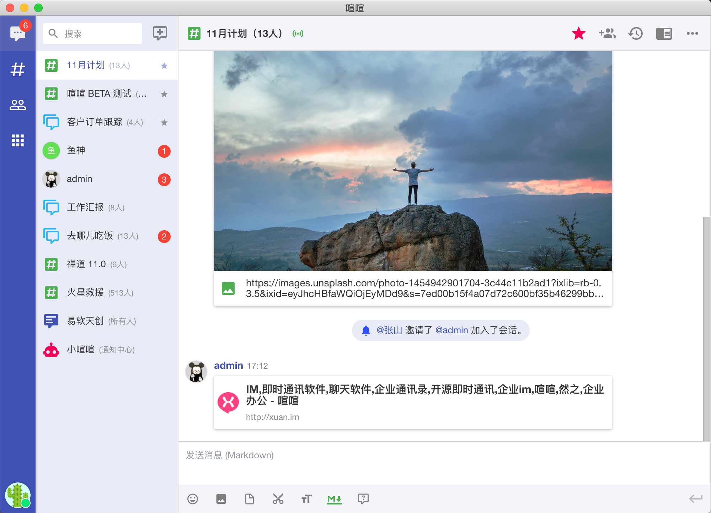

自定义解析如下图所示：

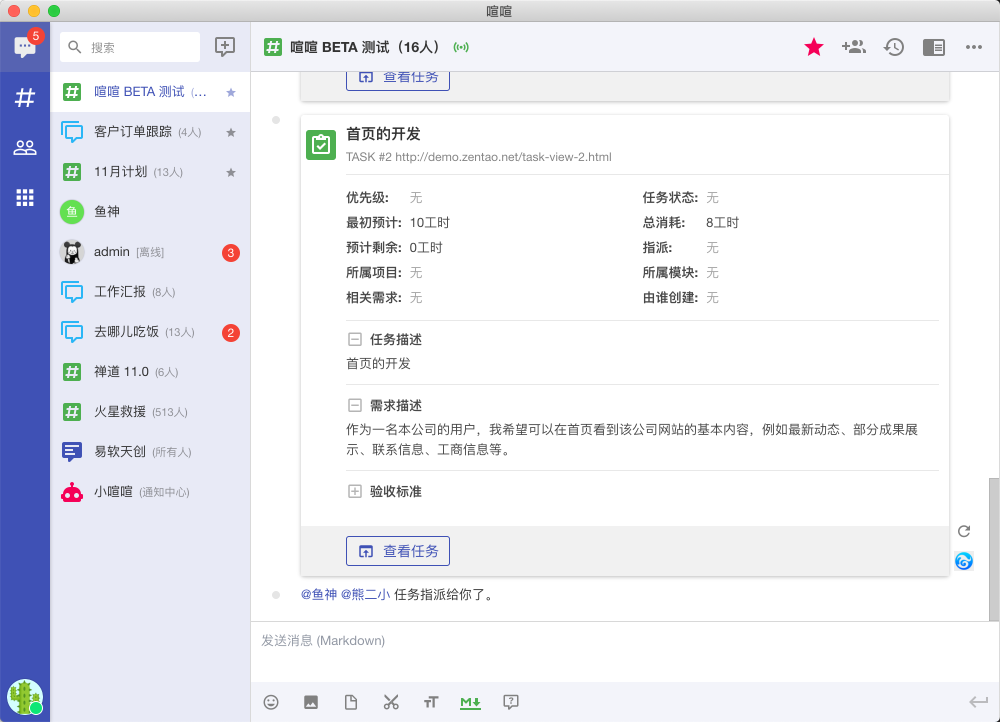

#### 网址解析对象

一个网址解析对象包含如下属性：

* `test`：必须字段，类型为正则表达式或者回调函数 `function(url: string):boolean`，用于判断此解析器适用于哪些网址，如果是回调函数，则回调函数第一个参数为要判断的网址，只有在回调函数返回 `true`，才会判定为使用此解析器；
* `getUrl`：可选字段，类型为回调函数 `function(url: string)`，使用此回调函数可以在解析之前进行一次转换，例如将用户发送的链接转换为免登录的链接，此回调函数应该返回转换后的链接地址，或者使用 Promise 来异步返回地址；
* `noMeta`: 类型 `boolean`，如果设置为 `true`，则跳过内置的解析结果，即不尝试自动访问链接获取链接标题等信息；
* `provider`：类型 `{icon: string, name: string, label: string, url: string}`，用于定义卡片提供方信息，默认使用扩展信息；
* `inspect`：必须字段，类型为回调函数 `function(url: string, meta: UrlMeta, cardMeta: Object)`，用于返回网址解析后的卡片定义对象，其中 `meta` 和 `cardMeta` 仅在 `noMeta` 字段没有设置为 `true` 的情况下提供，分别表示内置的解析结果和内置的卡片定义对象。

#### 卡片定义对象

网址解析对象的 `inspect` 回调函数应该返回一个卡片定义对象来告知如何呈现卡片。一个卡片定义对象包含如下属性：

* `icon`：卡片图标，可以使用 [Material Design Icons](https://materialdesignicons.com/) 图标名称或者 `http://` 或 `https://` 协议开头图片地址；
* `title`：卡片标题；
* `subtitle`：卡片副标题；
* `url`：卡片指向的链接地址；
* `clickable`：卡片可以点击并自动跳转链接的部分，可选值包括 `'title'`（标题）、`'subtitle'`（副标题）、`'header'`（整个头部）、`true`（整个卡片）和 `false`（无法点击）；
* `actions`：卡片操作按钮操作对象列表，通常显示在卡片底部；
* `menu`：卡片菜单操作对象列表，通常显示在卡片右侧；
* `content`：卡片的内容；
* `htmlContent`：卡片的正文文本内容，不过最终会以 HTML 源码形式在界面进行显示；
* `contentType`：卡片内容类型，包括 `'image'`（图片）、`'video'`（视频） 和 `'normal'`（普通卡片，默认类型）；
* `contentUrl`：当卡片类型为 `'image'`（图片）或 `'video'`（视频）时用于设置图片或视频的实际地址；
* `originContentType`：卡片实际内容类型，例如 `image/png` 等；
* `webviewContent`：是否设置卡片内容类型为 Webview（内嵌页面），如果设置为 `true`，则将 `content` 字段理解为 Webview 设置对象。

#### 操作对象定义

卡片定义对象中的 `actions` 和 `menu` 字段都为一个操作对象数组，每一个操作对象包含如下属性：

* `icon`：操作图标，可以使用 [Material Design Icons](https://materialdesignicons.com/) 图标名称或者 `http://` 或 `https://` 协议开头图片地址；
* `label`：操作名称；
* `btnClass`：操作按钮元素类名，包括 `'primary'`、`'success'`、`'danger'`、`'warning'`、`'info'`、`'important'`、`'sepcial'`，不同的类名获得不同的颜色外观；
* `click`：点击操作按钮时的回调函数；
* `url`：点击操作按钮时打开的链接。

在操作对象中 `click` 和 `url` 属性只能设置其中一个。

#### Webview 内嵌页面设置对象

当 `webviewContent` 设置为 `true` 时会将链接以内嵌页面的形式作为卡片内容显示，此时可以通过 `content` 字段对象来设置 Webview 各项功能。Webview 设置对象属性包括：

* `className`：类型为 `string`，添加到元素上的类名；
* `onLoadingChange`：类型为回调函数 `function(isLoading: boolean)`，当 Webview 开始加载或加载完成时会调用此回调函数，参数 `isLoading` 用于指示是否正在加载；
* `onPageTitleUpdated`：类型为回调函数 `function(title: string, explicitSet: boolean)`，当页面标题变更时会调用此函数，回调函数参数 `title` 为当前标题（变更后），回调函数参数 `explicitSet` 如果为 `true` 表示此标题是页面确切设置的标题（而不是临时或着缺省标题）；
* `src`：类型为 `string`，表示要加载的页面地址；
* `insertCss`：类型为 `string`，表示要注入要页面上的 CSS 样式代码；
* `executeJavaScript`：类型为 `string`，表示要在页面上执行的 JavaScript 代码；
* `onExecuteJavaScript`：类型为回调函数，表示执行 `executeJavaScript` 字段指定的 JavaScript 代码完成后的回调函数；
* `onNavigate`：类型为回调函数 `function(url: string, event: Event)`，表示页面导航到其他地址时的回调函数，函数参数 `url` 表示要导航的地址，`event` 表示导航事件对象；
* `onDomReady`：类型为回调函数，当页面 DOM 树加载就绪时调用；
* `injectForm`：类型为 JSON 字符串，表示页面表单注入对象；
* `useMobileAgent`：类型为 `boolean`，如果为 `true` 表示 Webview 的 userAgent 设置为模拟移动设备类型；
* `hideBeforeDOMReady`：类型为 `boolean`，如果为 `true` 表示在页面 DOM 数加载完成之前隐藏页面；
* `style`：要为 Webview 元素设置的 CSS 样式对象；
* `type`：Webview 类型，可选值包括 `'webview'`（使用 [Electron 内置的 webview 对象](https://electronjs.org/docs/api/webview-tag)）、`'iframe'`（使用 [`<iframe>` 元素](https://developer.mozilla.org/zh-CN/docs/Web/HTML/Element/iframe)） 或 `'auto'`（自动使用类型）。

Webview 内嵌页面设置对象中的 `injectForm` 可以用来将值注入到页面表单域上。该字段为一个对象，对象的属性名称为要注入的表单域名称，属性对应的值为要设置的值。

#### 自定义网址解析卡片的例子

下面的例子将禅道公开服务器网址都解析为内嵌 Webview 卡片形式：

```js
module.exports = {
    // 在扩展内定义网址解析
    commands: [
        {
            // test 函数用于判断一个url是否要进行特殊卡片渲染
            test: url => {
                const urlObj = new URL(url)
                const urlHost = urlObj.host;
                return ['.5upm.com', 'pms.zentao.net', 'demo.zentao.net', 'pro.demo.zentao.net', '.zentaopm.com', 'test.zentao.net'].some(x => urlHost.endsWith(x));
            },

            // 用于忽略系统内置的方式
            noMeta: true,

            // 用于决定最终url渲染的卡片配置
            inspect: (url) => {
                const cardMeta = {};
                cardMeta.title = null;
                cardMeta.webviewContent = true;
                cardMeta.icon = false;
                cardMeta.content = {
                    // url iframe 地址
                    src: url,
                    // iframe 高度和宽度设置
                    style: {height: '400px', width: '550px'},
                    // type 为 iframe 和 webview 方式则直接在卡片内加载页面
                    type: 'iframe'
                };
                return cardMeta;
            }
        },
        // 如果要定义多个网址解析，则可以在数组中继续添加更多的网址解析对象
    ]
}
```

## 开发扩展

### 载入开发中的扩展

当进行扩展开发时，无需将扩展打包为 `.zip` 文件进行安装测试，可以直接从开发目录加载扩展。从开发目录加载的扩展会显示 “开发中” 标签，检查并显示配置文件中的错误，并且提供重新载入等快捷操作。

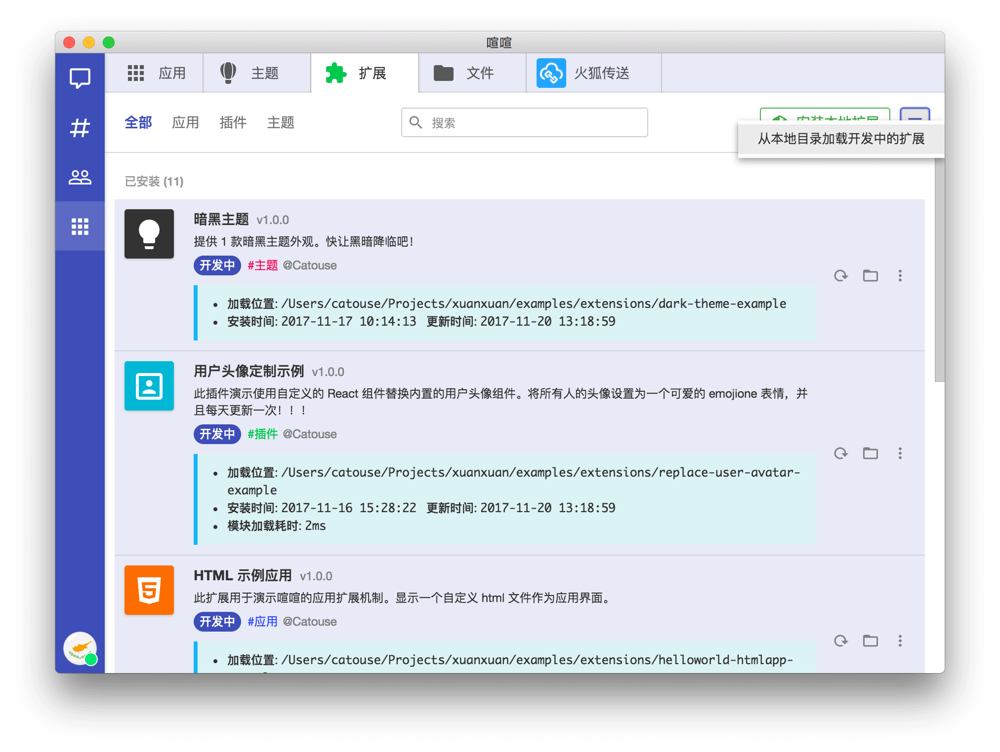

### 开发应用扩展

应用扩展可以方便开发者将自定义界面或网页嵌入到喧喧的界面中，方便用户直接在喧喧内访问使用。喧喧目前支持的应用嵌入方式包括：

* **Web 应用**：直接将一个能够访问的页面作为应用嵌入，非常适合集成已经开发好了的页面应用；
* **本地页面应用**：在扩展包中提供一个 HTML 文件作为页面嵌入，用于开发一个全新的应用，但不想受官方界面样式表和 React 模式限制，在你的 HTML 文件中执行的 JS 代码仍然可以使用 nodejs 的内置模块；
* **React 组件应用**：在入口模块的 `MainView` 属性上设置一个 React 组件作为嵌入的界面，方便的开发一个与官方界面融合的应用，在你的 React 组件中可以使用全部的 nodejs 内置模块，并访问全局扩展对象。

#### 开发 Web 应用

要开发 Web 应用，在最简单的情况下只需要在扩展包中包含描述文件 `package.json` 即可。下面以将火狐的文件传输应用包装为喧喧的应用扩展示例中的 `package.json` 文件内容：

```json
{
    "name": "firefox-send-example",
    "displayName": "火狐传送",
    "version": "1.0.0",
    "type": "app",
    "appType": "webView",
    "webViewUrl": "https://send.firefox.com/",
}
```

将写入以上内容的 `package.json` 文件打包为一个 zip 压缩文件，即可在喧喧中安装此应用扩展。

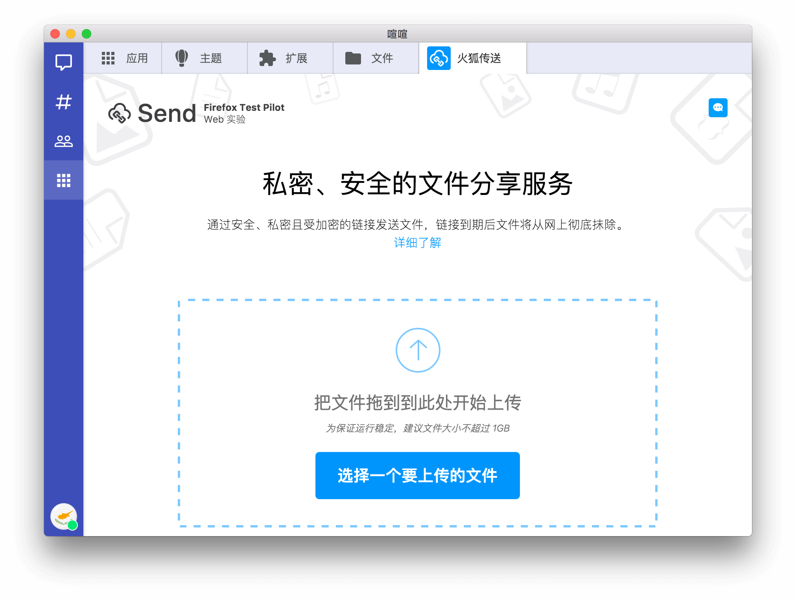

此扩展实例可以在 [${repository.clientSourceRoot}examples/extensions/firefox-send-example](${repository.sourceUrl}${repository.clientSourceRoot}examples/extensions/firefox-send-example) 找到源代码。

#### 开发本地页面应用

本地页面应用即在扩展包中提供一个 HTML 文件来作为应用扩展界面。下面为一个简单的本地页面应用扩展目录结构：

```
helloworld-htmlapp-example/
 ├─ views/
 │   └─ index.html         # 作为应用界面的 HTML 文件
 └─ package.json           # 扩展包描述文件
```

扩展包内源码文件内容如下：

<!-- tabs:start -->

##### ** package.json **

```json
{
    "name": "helloworld-htmlapp-example",
    "displayName": "HTML 示例应用",
    "version": "1.0.0",
    "description": "此扩展用于演示喧喧的应用扩展机制。显示一个自定义 html 文件作为应用界面。",
    "type": "app",
    "appIcon": "mdi-language-html5",
    "appAccentColor": "#ff6d00",
    "appType": "webView",
    "webViewUrl": "views/index.html",
    "author": {
        "name": "${author.name}"
    },
    "publisher": "${company}"
}
```

##### ** views/index.html **

```html
<!DOCTYPE html>
<html lang="en">
<head>
  <meta charset="UTF-8">
  <meta name="viewport" content="width=device-width, initial-scale=1.0">
  <meta http-equiv="X-UA-Compatible" content="ie=edge">
  <title>Document</title>
</head>
<body>
  <h1>Hello world!</h1>
</body>
</html>
```

<!-- tabs:end -->

最终效果如下图：

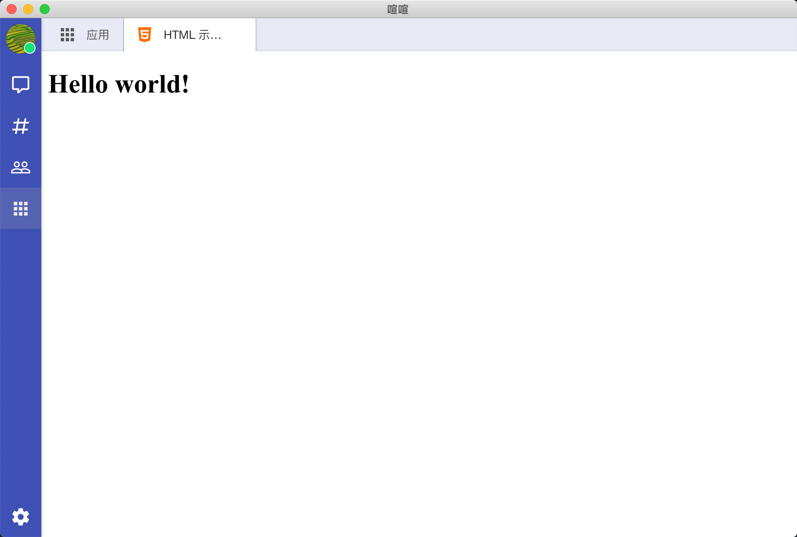

此扩展实例可以在 [${repository.clientSourceRoot}examples/extensions/helloworld-htmlapp-example](${repository.sourceUrl}${repository.clientSourceRoot}examples/extensions/helloworld-htmlapp-example) 找到源代码。

#### 开发 React 组件应用

应用扩展还可以使用一个 React 组件来呈现应用界面，当开发好 React 组件之后，需要在主入口模块的 `MainView` 字段指定要作为界面的 React 组件。下面为一个简单的 React 组件应用扩展包目录结构：

```
helloworld-app-example/
 ├─ lib/
 │   ├─ app-view.js      # 作为应用界面 React 组件
 │   └─ index.js         # 扩展主入口模块
 └─ package.json         # 扩展包描述文件
```

扩展包内源码文件内容如下：

<!-- tabs:start -->

##### ** package.json **

```json
{
    "name": "helloworld-app-example",
    "displayName": "示例应用",
    "version": "1.0.0",
    "description": "此扩展用于演示喧喧的应用扩展机制。从一个自定义的 React 组件来创建应用界面。",
    "type": "app",
    "hot": true,
    "appIcon": "mdi-react",
    "appAccentColor": "#aa00ff",
    "appType": "insideView",
    "main": "lib/index.js",
    "author": {
        "name": "${author.name}"
    },
    "publisher": "${company}"
}
```

##### ** lib/index.js **

```js
const MainView = require('./app-view.js');

module.exports = {
    MainView
};
```

##### ** lib/app-view.js **

```js
// 从全局扩展对象中引入模块
const {
    nodeModules,
} = global.Xext;

const {React} = nodeModules;

module.exports = () => React.createElement('div', {className: 'box red'}, '示例应用内容: Hello world!');
```

<!-- tabs:end -->

最终效果如下图：

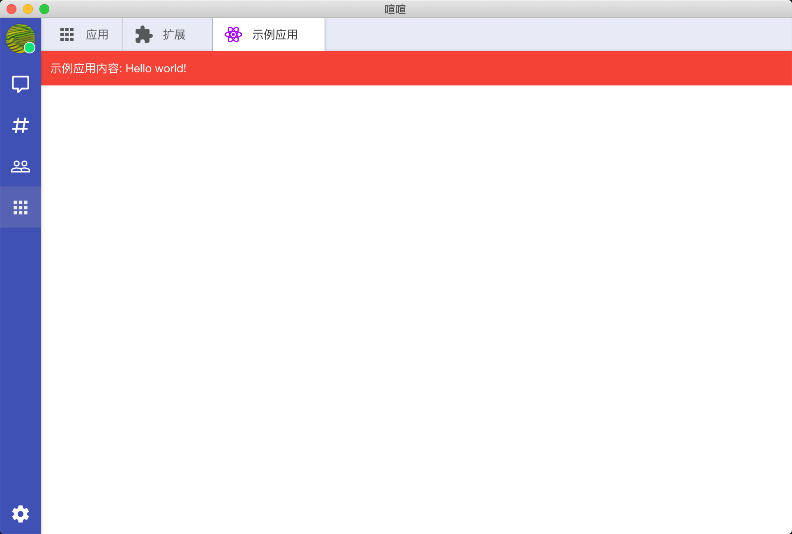

此扩展实例可以在 [${repository.clientSourceRoot}examples/extensions/helloworld-react-example](${repository.sourceUrl}${repository.clientSourceRoot}examples/extensions/helloworld-react-example) 找到源代码。

### 开发插件扩展

插件扩展通常不包含具体的界面，但可以在界面初始化及关键事件触发时得到通知并执行代码。例如可以通过监听用户发送消息，并在消息发送之前修改消息的内容。

每一个插件扩展需要提供一个入口模块文件，在 `package.json` 文件中通过 `main` 属性指定。如果不指定此文件则默认使用扩展包目录的 `index.js` 文件作为主入口模块文件。扩展主入口模块文件为一个 JavaScript 模块，当喧喧加载完毕时会逐个加载各个扩展的主入口模块。在扩展主入口模块中可以访问全局扩展对象 `global.Xext`。

下面为一个简单插件扩展包目录结构：

```
helloworld-plugin-example/
 ├─ lib/
 │   └─ index.js         # 扩展主入口模块
 └─ package.json         # 扩展包描述文件
```

扩展包内源码文件内容如下：

<!-- tabs:start -->

##### ** package.json **

```json
{
    "name": "helloworld-plugin-example",
    "displayName": "插件示例",
    "version": "1.0.0",
    "description": "此插件用于演示喧喧的插件机制。",
    "type": "plugin",
    "icon": "mdi-cards-playing-outline",
    "accentColor": "#afb42b",
    "hot": true,
    "main": "lib/index.js",
    "author": {
        "name": "${author.name}"
    },
    "publisher": "${company}"
}
```

##### ** lib/index.js **

```js
// 从全局扩展对象中引入模块
const {
    app,
    components,
    utils
} = global.Xext;

// 用于存储计时器标志
let timerTask = null;

module.exports = {
    onAttach: (ext) => {
        console.log('>> 扩展【helloworld-plugin-example】：扩展加载完成，刚刚加载等扩展名称是：' + ext.displayName);
    },

    onReady: (ext) => {
        console.log('>> 扩展【helloworld-plugin-example】：界面已准备就绪。', ext.displayName);
    },

    onDetach: (ext) => {
        // 扩展将被卸载，此时应该清理计时器
        clearTimeout(timerTask);
        timerTask = null;
        console.log('>> 扩展【helloworld-plugin-example】：扩展已卸载。', ext.displayName);
    },

    onUserLogin: (user, error) => {
        // 当用户登录时在此处可以进行相关操作，下面以显示当前登录等结果和用户名为例
        if (user && !error) { // 表示登录成功
            console.log('>> 扩展【helloworld-plugin-example】：用户登录成功了，用户名称是：' + user.displayName);
        }
    },

    onUserLoginout: (user) => {
        if (user) {
            console.log('>> 扩展【helloworld-plugin-example】：用户退出登录了，用户名称是：' + user.displayName);
        }
    },

    onUserStatusChange: (status, oldStatus, user) => {
        console.log('>> 扩展【helloworld-plugin-example】：用户状态发生变化了', {status, oldStatus, user});
    },

    onSendChatMessages: (messages, chat, user) => {
        console.log('>> 扩展【helloworld-plugin-example】：用户发送了消息', {messages, chat, user});
    },

    onReceiveChatMessages: (messages, user) => {
        console.log('>> 扩展【helloworld-plugin-example】：用户收到了消息', {messages, user});
    },

    commands: {
        saveText: (context, ...params) => {
            console.log('保存文本成功');
            return 'ok';
        }
    },

    contextMenuCreators: [{
        match: 'message.text',
        items: [{
            icon: 'mdi-emoticon-cool',
            label: 'say hello',
            click: () => {
                alert('hello');
            }
        }, {
            icon: 'mdi-earth',
            label: '访问禅道',
            url: 'http://zentao.net'
        }]
    }, {
        match: 'chat.sendbox.toolbar',
        create: context => {
            return [{
                label: 'say hello',
                click: () => {
                    context.sendContent('Hello!');
                }
            }];
        }
    }]
};
```

<!-- tabs:end -->

此扩展实例可以在 [${repository.clientSourceRoot}examples/extensions/helloworld-plugin-example](${repository.sourceUrl}${repository.clientSourceRoot}examples/extensions/helloworld-plugin-example) 找到源代码。

### 开发主题扩展

主题扩展用于为喧喧提供额外的外观选项。一个主题扩展中可以提供多款主题供用户选择使用。主题扩展所提供的主题在 `package.json` 文件中通过 `themes` 字段进行声明。`themes` 字段为一个对象数组，数组中的每个对象为一个主题配置。

主题的 css 文件载入方式包括两种：

* `append`：将 css 文件作为默认样式表的补充，即挂在在默认主题样式的后面；
* `override`：将 css 文件替换原来的默认样式表。

下面以官方暗黑主题扩展为例，此扩展目录结构如下：

```
dark-theme-example/
 ├─ themes/
 │   └─ dark.css         # 主题样式表文件
 └─ package.json         # 扩展包描述文件
```

扩展包内源码文件内容如下：

<!-- tabs:start -->

##### ** package.json **

```json
{
    "name": "dakr-theme-example",
    "displayName": "暗黑主题",
    "version": "1.0.0",
    "description": "提供 1 款暗黑主题外观。快让黑暗降临吧！",
    "type": "theme",
    "icon": "mdi-lightbulb",
    "accentColor": "#333",
    "themes": [
        {
            // 主题的名称，同一个扩展中的主题名称不能相同
            "name": "dark",

            // 主题在界面上显示的名称
            "displayName": "暗黑",

            // 主题的主色调
            "color": "#333",

            // 主题对应的 css 文件
            "style": "themes/dark.css",

            // 主题的载入方式
            "inject": "append"
        }
    ],
    // 其他配置
```

##### ** themes/dark.css **

```css
body {
	--color-primary: #f1f1f1;
}

.page,
select,
option,
body {
	color: #f1f1f1;
	background-color: #333;
}

/* 其他样式定义...*/
```

<!-- tabs:end -->

完整文件内容请参考 [${repository.sourceUrl}${repository.clientSourceRoot}app/build-in/easysoft-themes/themes/dark.css](${repository.sourceUrl}${repository.clientSourceRoot}app/build-in/easysoft-themes/themes/dark.css)。

最终效果如下图：

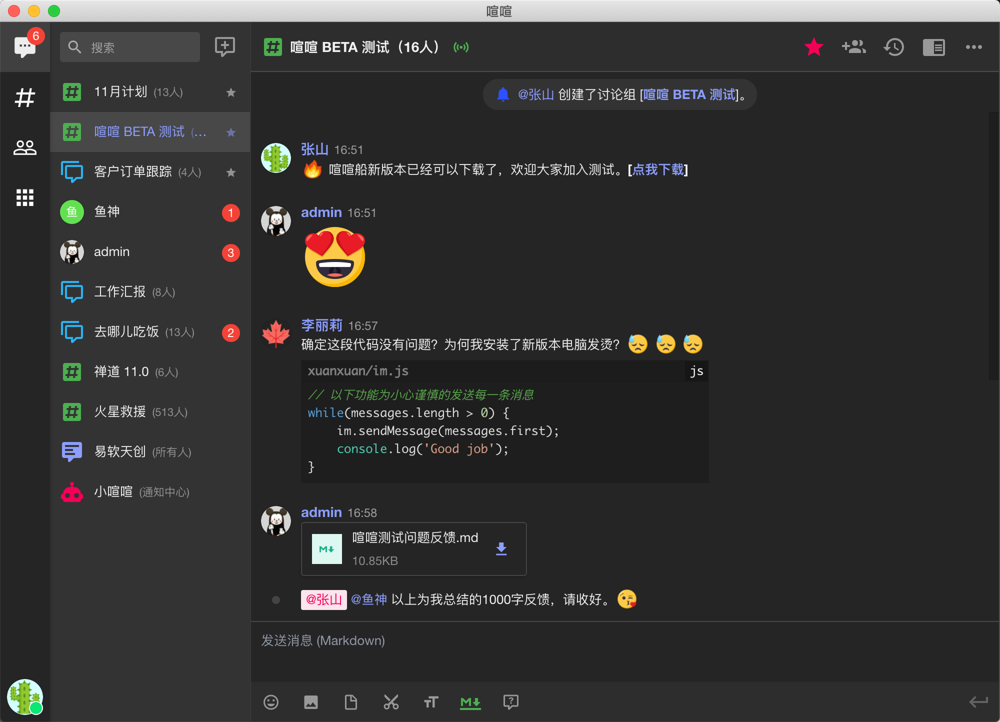

## 内置扩展

喧喧目前内置如下应用扩展：

| 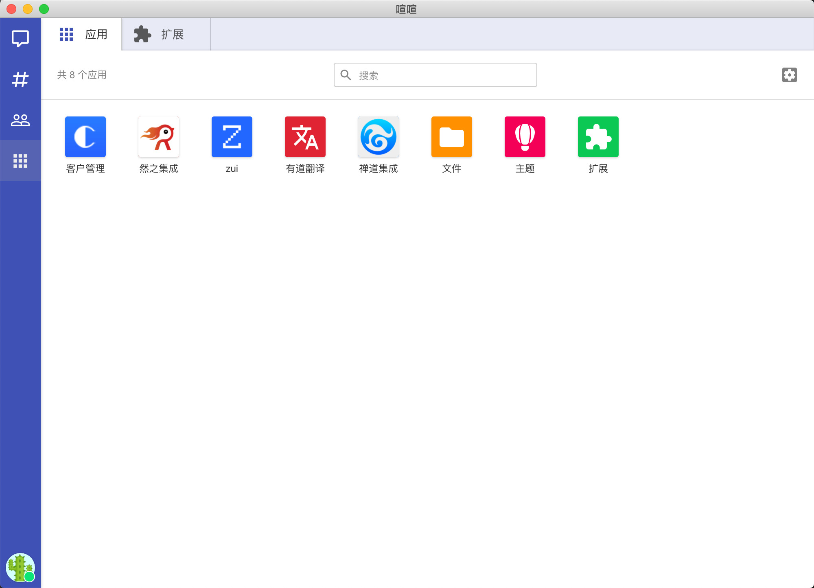 | 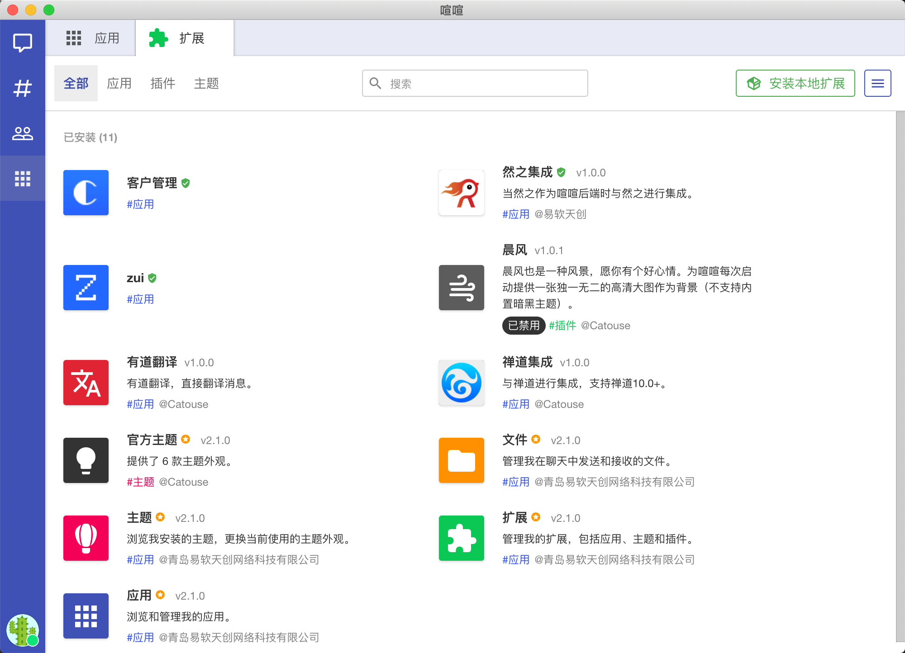 |
| ---- | ---- |
| 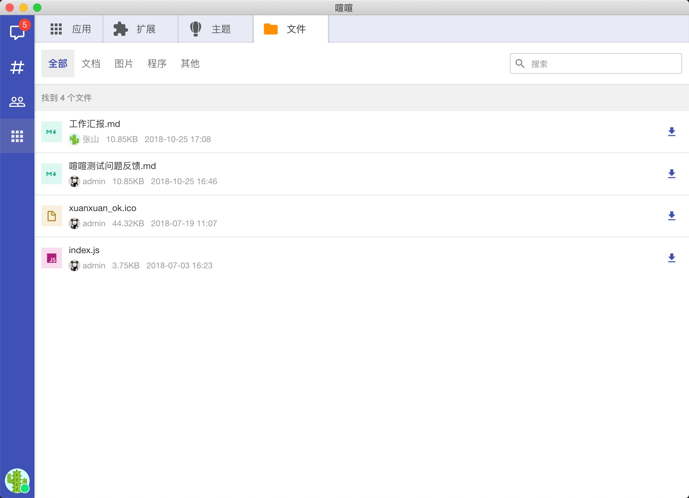 | 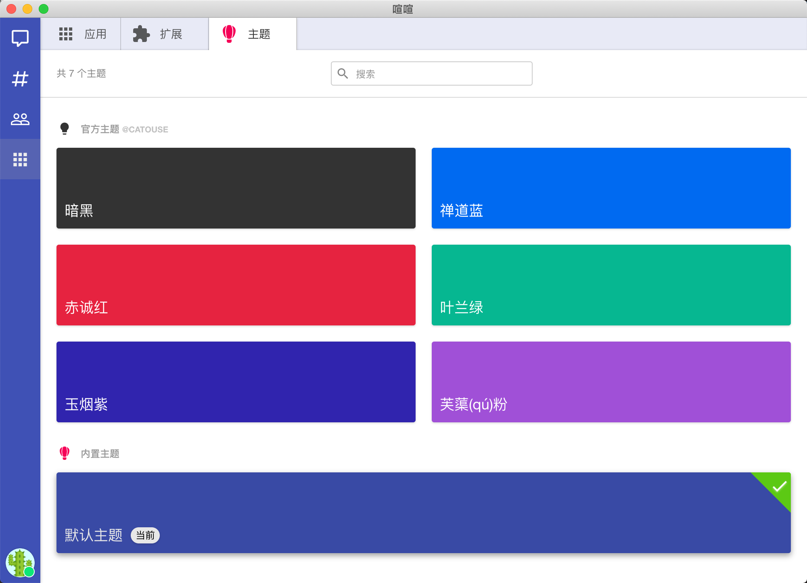 |


## 服务器扩展

喧喧应用还支持使用服务器上管理的远程扩展，用户登录到服务器之后自动从服务器上下载扩展并进行安装使用。当用户退出登录后，服务器扩展会自动卸载。

要在服务器上添加扩展参考 [服务器远程扩展文档](xxb/remote-extension)。