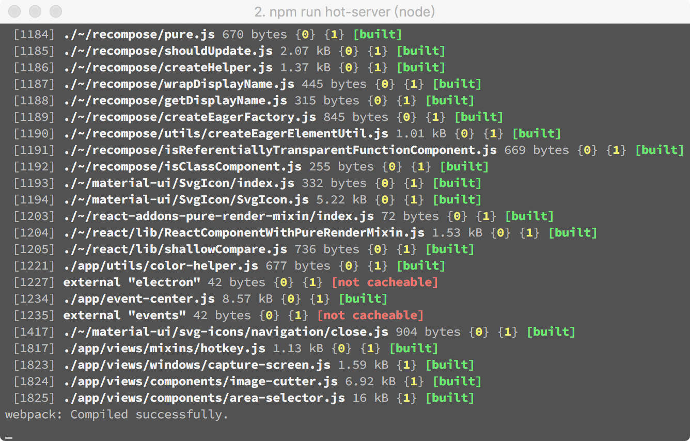
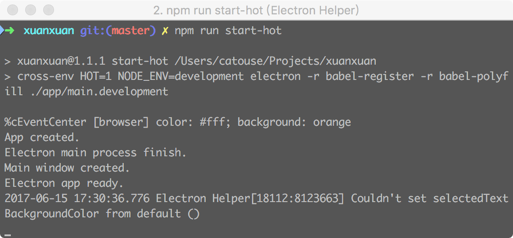
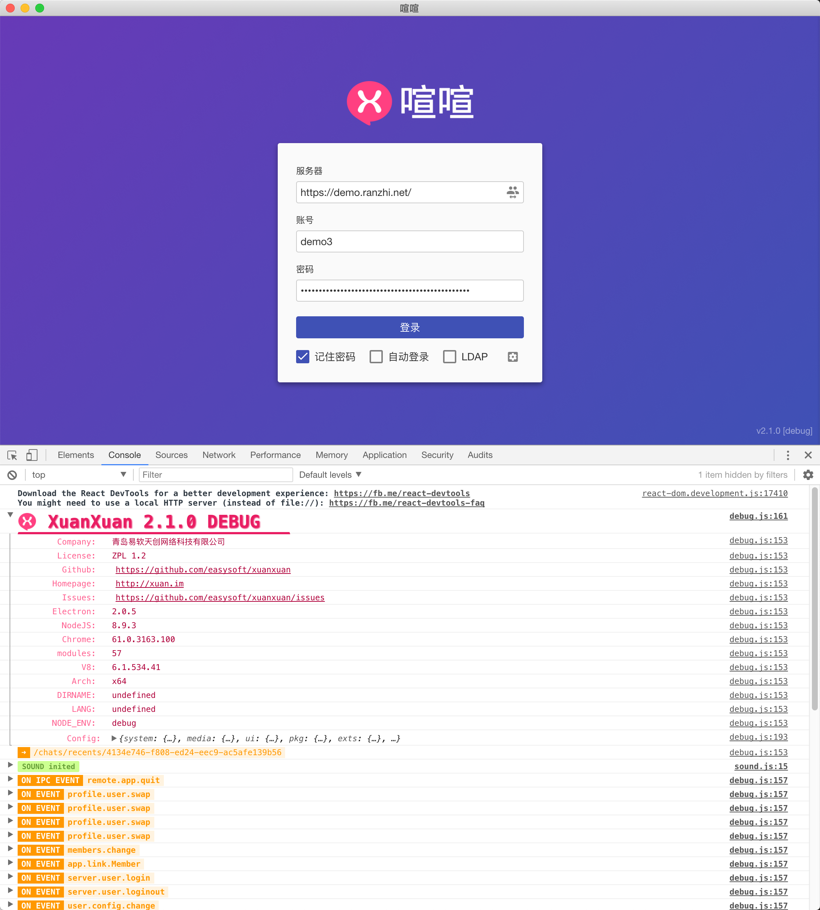

# 环境搭建

本文将指导如何搭建${displayName}开发环境，成功进入${displayName}客户端开发调试模式。

阅读本文需要你具备如下技能：

* 能够简单使用命令行执行程序，如果遇到问题可以通过 [CodeCademy 上的免费课程](https://www.codecademy.com/learn/learn-the-command-line) 进行学习；
* 能够使用 [npm 和 `package.json` 文件进行包管理](https://docs.npmjs.com/getting-started/using-a-package.json)。

## 快速开始

如果你已经能够熟练掌握 [Node.js](https://nodejs.org/zh-cn/) 和 [npm](https://www.npmjs.com/) 的使用，则可以跳过下面的 [“详细步骤”章节](#详细步骤)，直接在命令行窗口（Mac 下为应用 “终端”，Windows 下为程序 “命令提示符” 或 “PowerShell”）执行如下命令即可获取源码并启动桌面端调试环境：

```bash
# 使用 git 克隆项目源代码
$ git clone ${repository.url}

# 进入源码目录中的客户端开发目录
$ cd ${name}/${repository.clientSourceRoot}

# 使用 npm 安装开发环境依赖模块
$ npm install

# 启动热更新服务
$ npm run hot-server
```

新开一个命令行窗口，执行：

```bash
# 启动调试模式客户端
$ npm run start-hot
```

如果你在上述过程中遇到问题，请查下面的 [“详细步骤”章节](#详细步骤)。

## 详细步骤

### 1. 安装 Node.js 和 npm

访问 [Node.js 官网](https://nodejs.org/zh-cn/)下载并安装 Node.js，选择一个适合你的操作系统的安装包，按照官方提示安装即可。虽然不同的 nodejs 版本都可以运行${displayName}，但可能需要额外的配置，建议你下载与${displayName}开发者相同版本的 Node.js 版本。官方开发人员目前使用的 Node.js 环境版本是 **`8.11.3`**，npm 版本为 **`5.6.0`**，你可以在这个页面 https://nodejs.org/zh-cn/download/releases/ 找到对应版本的下载地址。

?> 如果你的系统已经安装有其他版本的 Node.js，并且不想卸载之前的版本，则推荐你使用 [nvm](https://github.com/creationix/nvm)。nvm 允许你安装 Node.js 的多个版本，并且可以自由切换当前使用的版本。

Windows 和 Mac 系统用户可以直接下载非常方便的一键安装包，安装完成后打开命令行窗口输入如下命令查询安装后的版本号，如果输出正确版本号说明安装成功。

```bash
# 查询 Node.js 是否安装，如果安装会显示版本号
$ node -v
v8.11.3

# 查询 npm 是否安装，如果安装会显示版本号
$ npm -v
5.6.0
```

### 2. 下载${displayName}源码

如果你的系统中安装有 [git](https://git-scm.com/)，只需要在命令行窗口执行如下命令来下载最新版的${displayName}源码：

```bash
$ git clone ${repository.url}
```

上述命令执行完成后就会在你的系统创建一个名称为 `${name}` 的目录，该目录内就是${displayName}最新的源码。

?> 无法你无法访问 [github.com](https://github.com)，你可以可以使用码云上的镜像库 [`https://gitee.com/wwccss/xuanxuan.git`](https://gitee.com/wwccss/xuanxuan.git)。

如果你还没有安装或使用过 [git](https://git-scm.com/) 也不用担心，你仍然可以访问 [${displayName}在 Github 上的页面](${repository.siteUrl})，直接点击 [“Download ZIP”](${repository.siteUrl}archive/master.zip) 来下载源码。下载完成后将 zip 文件解压到 `${name}` 目录下即可。

下载完成后从命令窗口进入${displayName}源码目录内的客户端开发目录 `${repository.clientSourceRoot}`：

```bash
$ cd ${name}/${repository.clientSourceRoot}
```

?> 以下所有命令默认情况都是在客户端开发目录 `${repository.clientSourceRoot}` 内执行的。

### 3. 安装项目依赖

从命令行进入下载好的${displayName}源码目录（以下默认为 `xuanxuan/`），执行如下命令：

```bash
$ npm install
```

#### 安装失败？

此步骤通常需要几分钟，视网络环境执行的时间不定。如果你使用的是国内网络，可能导致某些依赖模块安装失败。下面介绍使用国内 **[淘宝 NPM 镜像](https://npm.taobao.org/)** 来加速安装过程，确保安装成功。

##### 将镜像地址写入 `~/.npmrc`

在你的系统找到 `~/.npmrc` 文件，并用文本编辑器打开，写入如下内容到文件：

```bash
registry=https://registry.npm.taobao.org/
disturl=https://npm.taobao.org/dist
```

!> `.npmrc` 文件在系统的个人文件目录下，不同的操作系统上对应的路径不同，Windows 用户此文件通常在 `C:/Users/<UserName>/.npmrc`，Mac 用户此文件通常在 `/Users/<UserName>/.npmrc`。

写好配置后可以使用 `npm info` 命令检查下是否生效，以下为查看 [ZUI](http://zui.sexy) 为例：

```bash
$ npm info zui
```

如果在命令行输出信息的结尾找到 ZUI 的下载地址为 `registry.npm.taobao.com`，说明配置生效了。

```bash
...
dist:
    { shasum: '134f986bc53a62be2310a0438918b8a17b58c80c',
        size: 9957159,
        noattachment: false,
     tarball: '**http://registry.npm.taobao.org/zui/download/zui-1.6.0.tgz**' },
  publish_time: 1489730305654 }
...
```

这样再次执行 `npm install` 命令就可以使用国内的淘宝镜像进行依赖模块的安装了。

#### 安装 Electron 失败？

##### 设置 ELECTRON_MIRROR 环境变量

设置 Electron 环境变量，在 Mac 或 Linux 下执行：

```
$ export ELECTRON_MIRROR="https://npm.taobao.org/mirrors/electron/"
```

Windows 用户需要打开系统属性面板来设置环境变量（变量名称为 `ELECTRON_MIRROR`，值为 `https://npm.taobao.org/mirrors/electron/`）。

做了如上设置后，请重新执行 `npm install`。
Windows 用户注意，设置新的环境变量之后需要重新打开一个命令行窗口，所设置的环境变量才会生效。

##### 单独安装 Electron

如果仍然遇到问题，你可以尝试单独先安装 Electron，Mac 或 Linux 用户执行：

```
ELECTRON_MIRROR="https://npm.taobao.org/mirrors/electron/" npm install electron
```

Windows 用户无法直接运行上面的命令，需要先安装 `cross-env`：

```
$ npm install cross-env -g
```

然后再执行：

```
cross-env ELECTRON_MIRROR="https://npm.taobao.org/mirrors/electron/" npm install electron
```

这样就可以强制从淘宝镜像安装 Electron。

#### npm 镜像相关资源

如果你还有其他问题，请参考如下内容：

* [npm taobao 镜像官方网站](https://npm.taobao.org/)；
* [加速electron在国内的下载速度](http://blog.tomyail.com/install-electron-slow-in-china/)；
* [使用淘宝 NodeJS 镜像加速 Electron Node-Sass 的安装速度](http://zqlu.github.io/2016/05/10/taobao-nodejs-mirror/)；
* [安装node和npm并切换淘宝npm镜像源](https://blog.skyx.in/archives/206/)。

#### Can't find Python executable "python"?

```bash
gyp ERR! configure error
gyp ERR! stack Error: Can't find Python executable "python", you can set the PYTHON env variable.
gyp ERR! stack     at PythonFinder.failNoPython (C:\Users\Catouse\AppData\Roaming\nvm\v8.11.3\node_modules\npm\node_modules\node-gyp\lib\configure.js:483:19)
gyp ERR! stack     at PythonFinder.<anonymous> (C:\Users\Catouse\AppData\Roaming\nvm\v8.11.3\node_modules\npm\node_modules\node-gyp\lib\configure.js:508:16)
gyp ERR! stack     at C:\Users\Catouse\AppData\Roaming\nvm\v8.11.3\node_modules\npm\node_modules\graceful-fs\polyfills.js:284:29
gyp ERR! stack     at FSReqWrap.oncomplete (fs.js:152:21)
gyp ERR! System Windows_NT 6.1.7601
gyp ERR! command "C:\\Program Files\\nodejs\\node.exe" "C:\\Users\\Catouse\\AppData\\Roaming\\nvm\\v8.11.3\\node_modules\\npm\\node_modules\\node-gyp\\bin\\node-gyp.js" "rebuild"
gyp ERR! cwd F:\Projects\xuanxuan\xxc\node_modules\nodejieba
gyp ERR! node -v v8.11.3
gyp ERR! node-gyp -v v3.6.2
gyp ERR! not ok
```

上述错误是依赖模块 `nodejieba` 构建原生模块时的错误，因为 `nodejieba` 是一个可选模块，所以你可以直接忽略上述错误。要解决上述错误信息则需要按照错误提示安装 [python](https://www.python.org/downloads/)。

### 4. 启动开发服务器

如果你最后一次执行 `npm install` 没有出现任何错误，就可以启动开发服务器了。

#### 启动热更新服务器

在命令行窗口执行如下命令：

```
$ npm run hot-server
```

如果你在命令行窗口看到如下内容，说明热更新服务器成功启动：



热更新服务器用于监听源码文件更改，当你更改了源码之后会立即重新编译并通知界面组件进行刷新。这是一种所见即得的开发模式，也就是说你在源代码中的更改会即时反馈到界面上来。

!> 注意：只有 [React](https://react.docschina.org/) 组件模块会直接在界面上更新，如果是其他模块虽然仍然会实时编译，但并不会进行实时更换，此时你可以在界面上按页面刷新快捷键（Windows 为 <kbd>F5</kbd>，Mac 用户为 <kbd>Command+R</kbd>）来重新载入界面。

!> 从 [1.3.0 版本](${repository.siteUrl}releases/tag/v1.3.0)开始，${displayName}加入了扩展机制，支持通过扩展来动态替换界面组件，但也带来一个缺点就是支持通过扩展替换的组件无法在热更新中自动更新，此时仍然需要手动刷新界面来应用更改。

#### 启动客户端

打开一个新的命令行窗口（不要关闭之前打开的正在运行的热更新服务器命令行窗口）执行：

```
$ npm run start-hot
```

如果你在命令行窗口看到如下内容，说明客户端启动成功：



#### 首次启动时间过长？

当首次执行 `npm run start-hot` 时，Electron 会尝试下载安装 `REACT_DEVELOPER_TOOLS` 方便进行 React 开发调试，此时命令行会显示 `Install electron development extensions...`。正常情况下只需要几分钟，但在网络不佳的话可能导致首次启动时间过长。如果超过5分钟主界面还没启动，可以尝试禁用自动安装 Electron 扩展，方法是使用 `npm run start-hot-fast` 代替 `npm run start-hot` 命令。

#### 恭喜

通常情况下，如果以上步骤都成功，此时会在你的屏幕左侧打开一个新的窗口：窗口上方是${displayName}的界面，下方是 Electron 的开发者工具。



### 5. 退出调试模式

如果要退出调试模式，只需要将以上步骤中执行 `npm run hot-server` 和 `npm run start-hot` 命令的两个命令行窗口退出即可。

?> 要退出命令行窗口中正在执行的程序可以尝试使用快捷键 <kbd>Ctrl+C</kbd> 或 <kbd>Ctrl+D</kbd>，或者直接关闭命令行窗口。

## 启动浏览器端调试模式

${displayName} 支持在浏览器环境下使用。要启动浏览器端调试模式只需要在命令行窗口执行：

```bash
$ npm run hot-server-browser
```

正常情况下会使用操作系统默认浏览器打开${displayName}浏览器版页面（默认访问地址为：[http://localhost:3000?hot=1](http://localhost:3000?hot=1)）。如果要查看调试信息，需要打开浏览器的开发者工具（以 Chrome 浏览器为例，[在Chrome菜单中选择 **更多工具** > **开发者工具**](https://developers.google.com/web/tools/chrome-devtools/?hl=zh-cn)，其他浏览器类似）。

?> 此步骤实际上是执行 [`${repository.clientSourceRoot}build/server.js`](${repository.sourceUrl}${repository.clientSourceRoot}build/server.js) 文件，使用 [`http-server`](https://github.com/indexzero/http-server) 启动了一个静态服务器来访问 [`${repository.clientSourceRoot}app/index.html`](${repository.sourceUrl}${repository.clientSourceRoot}app/index.html) 文件。

如果要退出调试模式，只需要将以上步骤中执行 `npm run hot-server-browser` 的命令行窗口退出即可。

## 常见问题

### 如何保持版本库代码最新

当你本地版本库版本落后于官方版本，如果没有对官方代码进行任何修改，只需要执行如下命令即可保持代码最新：

```bash
$ git pull
```

如果你修改了官方代码，则需要手动进行合并操作。

欢迎将你的修改提交到官方代码库中，这样就可以参与到官方开发中来，一起让${displayName}变得更好。详情参考 [参与到官方开发](client/contribute) 文档。

### Cannot find 'xxx' module？

通常是由于客户端依赖的某个模块没有安装。如果还没有搭建好${displayName}开发环境，则参照上文先搭建环境，如果是后续更新代码导致的，则需要重新执行 `npm install`。